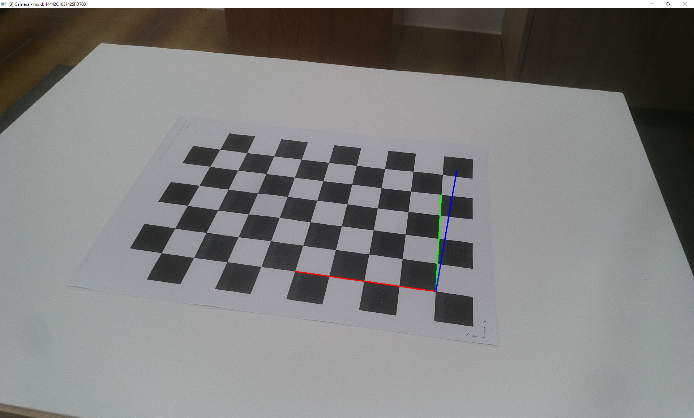
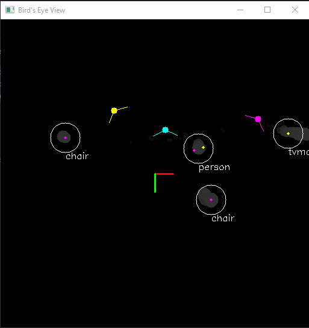

# Multi camera tracking
This example demonstrates calibration and tracking with multiple Luxonis OAK cameras. Position of each object in then shown in bird's-eye view. 

## Controls
| key 			| action
| :---			| :---			|
| `1` ... `9` 	| select camera |
| `q`			| quit 			|
| `p`			| start pose estimation |
| `d`			| toggle depth view |


## Usage
1. Run demo: 
    ``` 
    python3 main.py
    ```

**Measure the pose of the camera**

Press the `p` key to estimate the pose of the camera. An overlay showing the coordinate system will appear and the pose of the camera will be saved to a file. To dismiss the overlay press any key. \
*Repeat for every camera.* 



When a camera's pose is measured, it will appear in the bird's-eye view along with its detected objects.



