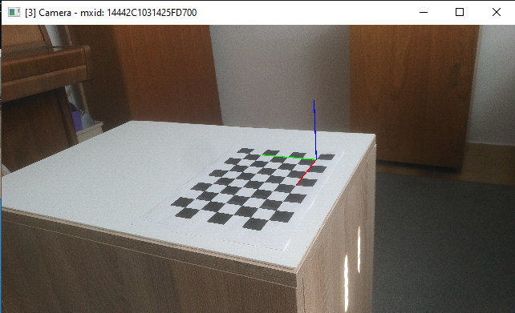

# Multi camera calibration
This example demonstrates multiple Luxonis OAK cameras tracking objects and showing their position in bird's-eye view. 

## Controls
| key 			| action
| :---			| :---			|
| `1` ... `9` 	| select camera |
| `q`			| quit 			|
| `c`			| capture calibration frame |
| `s`			| compute intrinsic matrix and distortion coefficients and save the results  |
| `p`			| start pose estimation |
| `t`			| capture a still image |
| `d`			| toggle depth view |
| `o`			| show the position of other cameras on the image of the selected camera |

## Usage
Run the [`main.py`](main.py) with Python 3.

1. __Calibrate camera to correct for lens distortion__ \
	Select a camera. Point the camera towards the [checkerboard](pattern.pdf). Move the camera around and capture around 10 calibration frames by pressing the `c` key. Every time a calibration frame is captured an overlay showing the detected checkerboard appears. Press any key to resume. \
	Next press the `s` key to compute intrinsic matrix and distortion coefficients and save the results. \
	_Repeat for every camera_.
	
	
2. __Measure the pose of the camera__ \
	Press the `p` key to estimate the pose of the camera. An overlay showing the coordinate system will appear. The pose of the camera will be saved to a file. \
	_Repeat for every camera_. 
	

When a camera's pose is measured, it will appear in the bird's-eye view along with detected objects.
